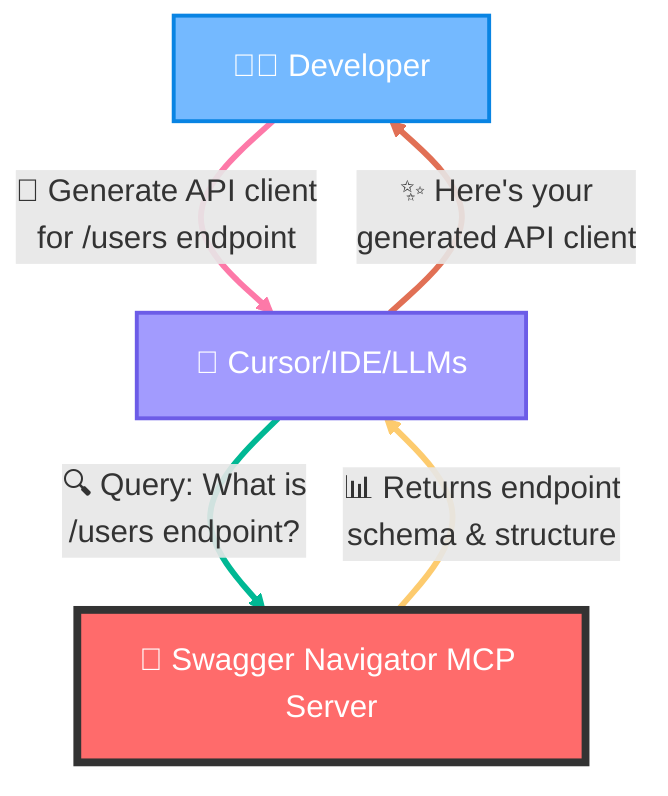

# 🔍 Swagger Navigator MCP Server

[](LICENSE)
[](https://nodejs.org)
[](https://www.typescriptlang.org)

An MCP server implementation that provides intelligent discovery and search capabilities for Swagger/OpenAPI endpoints. This tool enables AI assistants to dynamically explore, understand, and interact with REST APIs by parsing OpenAPI specifications and providing fuzzy search across endpoints.

---

## 🚀 How It Works

The Swagger Navigator MCP Server acts as an intelligent API knowledge hub, seamlessly connecting developers with their API specifications. When you ask Cursor/Claude/LLMs to generate API clients, anticorruption layers, or type definitions, Cursor/Claude/LLMs consults the MCP server to get accurate, structured API information and then generates perfect code based on the actual API schema.



---

## ✨ Features

- **🔍 Dynamic API Discovery**: Automatically parse and index Swagger/OpenAPI specifications from multiple sources
- **🎯 Intelligent Search**: Use fuzzy matching to find relevant endpoints based on natural language queries
- **🔗 Multi-source Support**: Handle both local files and remote HTTP endpoints with authentication
- **⚡ Real-time Updates**: Monitor configuration changes and refresh API data automatically
- **🔄 Hot-reload Configuration**: Detect config file changes without server restart

---

## 🛠️ Tools

### 📋 `list_all_sources`

Retrieves a comprehensive list of all available Swagger/OpenAPI sources in the system.

**Purpose:**

- Provides overview of all loaded API specifications
- Shows available APIs for search and exploration
- Returns source names for use with other tools

**Returns:**

- Array of sources with name, description, and OpenAPI info (title, version)

### 📄 `list_endpoints_for_source`

Retrieves all endpoints from a specific API source with pagination support.

**Inputs:**

- `name` (string): The source name to list endpoints for
- `limit` (number, optional): Maximum endpoints to return (1-100, default: 10)
- `offset` (number, optional): Number of endpoints to skip (default: 0)

**Returns:**

- Array of endpoints with path, method, description, and metadata
- Pagination information with total count and navigation flags

### 🔎 `search_endpoint`

Intelligently searches endpoints using fuzzy matching across multiple attributes.

**Inputs:**

- `query` (string): Search query using natural language (e.g., "create user", "authentication", "GET users")

**Returns:**

- Ranked array of matching endpoints with relevance scores
- Weighted search across descriptions, paths, methods, and tags

---

## ⚙️ Configuration

### 🤖 Usage with Cursor

Add this to your `~/.cursor/mcp.json`:

#### Using npx

```json
{
  "mcpServers": {
    "swagger-navigator-mcp": {
      "command": "npx",
      "args": ["-y", "swagger-navigator-mcp"],
      "env": {
        "CONFIG_PATH": "path/to/swagger-navigator-mcp.config.yaml"
      }
    }
  }
}
```

### 📝 Configuration File

Create a `swagger-navigator-mcp.config.yaml` file:

```yaml
# Swagger Navigator MCP Server Configuration

sources:
  # Local file example
  - name: "petstore-local"
    source: "./specs/petstore.json"
    description: "Local Petstore API specification"

  # Remote HTTP source with authentication
  - name: "github-api"
    source: "https://api.github.com"
    description: "GitHub REST API v3"
    headers:
      Authorization: "token ${GITHUB_TOKEN}"
      Accept: "application/vnd.github.v3+json"

  # API with custom headers
  - name: "internal-api"
    source: "https://internal.company.com/api/swagger.json"
    description: "Internal company API"
    headers:
      X-API-Key: "${API_KEY}"

# Optional: Search configuration
search:
  fuzzyThreshold: 0.6 # 0-1, lower = more fuzzy matching

# Optional: Refresh interval in seconds
refreshInterval: 300 # Refresh every 5 minutes
```

### 🔐 Environment Variable Substitution

The configuration file supports environment variable substitution using `${VARIABLE_NAME}` syntax. This allows you to securely store sensitive information like API keys and tokens outside of your configuration file.

**Examples:**

- `${GITHUB_TOKEN}` - Substituted with the value of the `GITHUB_TOKEN` environment variable
- `${API_KEY}` - Substituted with the value of the `API_KEY` environment variable
- `${DATABASE_URL}` - Any environment variable can be used

> **Note:** If an environment variable is not set, the substitution will result in an empty string.

### 🌍 Environment Variables

Set environment variables for configuration and authentication:

```bash
export CONFIG_PATH="./swagger-navigator-mcp.config.yaml"
export GITHUB_TOKEN="your-github-token"
export API_KEY="your-api-key"
```

---

## 🚀 Usage

### 📦 Install Dependencies

```bash
npm install
```

### 🔨 Build the Project

```bash
npm run build
```

### ▶️ Start the Server

```bash
CONFIG_PATH=./swagger-navigator-mcp.config.yaml npm start
```

### 🧪 Development Mode

```bash
npm run dev
```

---

## 📄 License

This project is licensed under the MIT License - see the [LICENSE](LICENSE) file for details.
